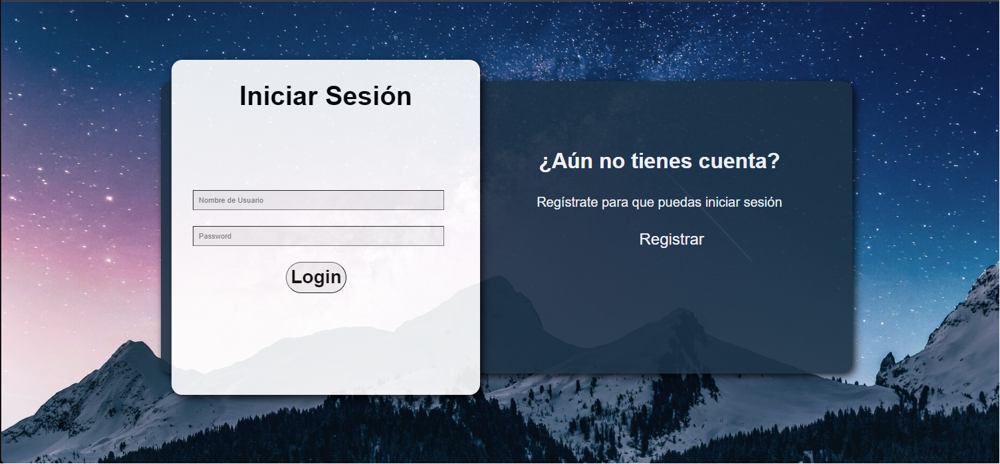

:toc: left 

= Proyecto GExpenses

== Introduccion

La siguiente memoria se ha realizado con el propósito de hacer un seguimiento exhaustivo del trabajo realizado en el proyecto 1 de ABP. Se explicará en detalle todos los aspectos y funcionalidades que se han ido desarrollando durante los últimos 3 meses del producto, asimismo del objetivo y mejoras implementadas de éste respecto a su última entrega.

=== Objetivos y alcance del proyecto

Este proyecto está orientado a crear una página web para llevar las cuentas de un viaje y calcular cuánto dinero debe pagar cada uno y a quién.

GExpenses es una página web que ayuda a las personas a repartir los gastos que involucran una actividad entre un grupo de personas para facilitar la repartición equitativa de dinero entre ellas. En este momento, GExpenses es capaz de poder crear actividades y poder añadir adscritos a ellas, y también asignarle a los adscritos la cantidad de dinero que deben pagar por realizar la actividad en sí.

Como finalidad principal, GExpenses se encarga de gestionar los pagos de un grupo de personas al realizar una actividad a través de una interfaz que permite al usuario registrarse en nuestra página web y poder crear y visualizar las actividades, adscritos y el reparto de dinero.

GExpenses está formado por los siguientes componentes:

. Una base de datos para guardar toda la información.
. Una base de datos para guardar toda la información.
. El framework PHPUnit para realizar los testeos unitarios de los repositorios y validar la lógica de la ejecución de código.
. Un entorno de producción Vagrant.

=== Planificación del trabajo

La planificación de trabajo que se ha seguido para poder desarrollar este producto se ha dividido en varias fases.

Fase 1: análisis de los requisitos que se piden en el producto.

Fase 2: estudio de las tecnologías necesarias para desarrollar el producto. 

Fase 3: diseño del producto (sketchings, wireframes y mockups).

Fase 4: creación del entorno de trabajo Vagrant y diseño de la base de datos.

Fase 5: implementación de las funcionalidades del producto

Fase 6: pruebas y testeos unitarios.

Fase 7: elaboración de la memória y vídeo.

Teniendo en consideración que me informaron de recuperar el día 13 de abril  y que parte de requisitos del producto ya estaban en desarrollo, he calculado invertir unas 3 horas diarias para poder llegar a entregar el producto final el día 11/06/2023.

image::imagesMemoria/planificacion.png[]

Además, he creado un trello para que el profesorado pueda monitorear en todo momento las tareas que estoy realizando y las horas que he tardado en realizarlas. Este Trello lo he organizado en  7 tarjetas llamadas SPRINTS# donde se explica el trabajo por hacer de cada una. Para finalizar, he dividido el Trello en 5 apartados: PLANIFICACIÓN, BACKLOG, LISTA COSAS POR HACER, LISTA COSAS HACIENDO Y LISTA COSAS HECHAS.

image::imagesMemoria/trello.png[]

==  Seguimiento del proyecto

=== Semana 1.

Durante esta semana me he centrado en estudiar y repasar php y javascript para poder realizar el proyecto. Empecé leyendo el temario de php / javascript y empecé a estudiar el estado del producto.

=== Semana 2.

Durante esta semana he creado un Trello para empezar a organizar mi trabajo. El Trello lo he organizado en SPRINTS con colores para identificarlos más fácilmente. He empezado a analizar todas las tareas por hacer y he empezado a diseñar una nueva base de datos para guardar bien los datos de la aplicación.

image::imagesMemoria/semana_2.png[]

=== Semana 3.

Durante esta semana he acabado de definir una primera base de datos, y he creado una tabla llamada “sesion” para guardar en ésta todos los usuarios que hacen login en mi aplicación. Además, he arreglado problemas con el css como hacer fixed el footer y mostrar correctamente los botones.

image::imagesMemoria/semana_3.png[]

=== Semana 4.

Durante esta semana he refactorizado todo el código del archivo home.php, creando un repositorio ActividadRepository.php  para separar toda la lógica a la hora de insertar y visualizar una actividad del resto del código.  Además he arreglado el botón ORDENAR, sustituyéndolo por los botones ORDENAR FECHA y ORDENAR MOD. Además, he vuelto a hacer funcional el botón AÑADIR.

image::imagesMemoria/semana_4.png[]

=== Semana 5.

Esta semana la he aprovechado para acabar de organizar y arreglar todo el código de la página, creando los repositorios AdscritoRepositor.php, GastoRepository.php y InvitacionRepository.php para acabar de refactorizar todo el código encargado de añadir personas a una actividad, añadir gastos a una actividad, y insertar los adscritos de la actividad en base de datos.

=== Semana 6.

Esta semana he dedicado la mayor parte del tiempo a pensar cómo hacer los repartos avanzados por importe y por proporciones. He arreglado el pago simple refactorizando el código reparto.js para calcular el tipo de reparto en función de si el usuario selecciona “Pago básico”, “Pago avanzado por importes” o “Pago avanzado por proporciones”.

=== Semana 7.

Esta semana la he dedicado únicamente a acabar el pago avanzado por importe y por proporciones. Asimismo, he arreglado y documentado todos los bugs que he ido encontrando al finalizar el producto. He logrado acabar los requisitos extra que se pedían en el SPRINT#8 y he elaborado la memoria final .

== Manual de instalación

Para que se pueda ejecutar y probar el proyecto, hay que tener en consideración que GExpenses está subido en un entorno Vagrant y, por lo tanto, se debe tener conocimientos previos de esta herramienta. Si se tiene instalado Vagrant y VirtualBox en la máquina local, los pasos que hay que seguir para ejecutar el producto son los siguientes:

. Descargar la rama producto_final del repositorio github: https://github.com/SamyTheLight/gexpenses[repositorio github]
y abrirlo en un editor de código.

. Toda la lógica del producto y todo el código necesario para que funcione se encuentra en la carpeta Vagrant, por lo tanto: redirigir a ruta cd/vagrant

. Una vez dentro de la carpeta Vagrant, ejecutar el comando en la terminal vagrant up

. Una vez ejecutado el comando, la máquina ya se habrá creado. Si accedemos al archivo vagrantfile, podremos ver que la máquina hace uso de una conexión privada con la siguiente ip: 172.16.0.10, si ponemos esta ip en nuestro navegador, podremos acceder a la página de login y registro.

. Una vez finalizado los pasos anteriores, faltará leer el manual de usuario para usar la aplicación.

==  Manual de usuario

En el siguiente apartado se explicará el funcionamiento de la aplicación por parte de lo que visualizará el usuario.

=== Página de registro e inicio de sesión

Al entrar en la aplicación, la primera página que podremos visualizar es el login y registro, donde el usuario podrá introducir un nombre, un correo electrónico y una contraseña. La contraseña debe cumplir los siguientes requisitos: (1)8 caracteres máximo, (2)1 letra mayúscula y 1 minúscula, (3) un carácter especial. En mi caso, suelo usar esta contraseña para testear: aA12345678*.

Una vez registrado, solo quedará ir al apartado de login dando clic en el botón Login, e introducir el NOMBRE (no correo electrónico) y CONTRASEÑA.

=== Página home - creación de actividades 

Una vez logueado, nos redirigirá a la página Home, donde podremos ver una interfaz donde se muestran los botones AÑADIR, ORDENAR FECHA y ORDENAR MODIFICACIÓN. 

image::imagesMemoria/home_1.png[]

Si damos click en AÑADIR, nos mostrará un POP-UP donde podremos ver un formulario para añadir una actividad introduciendo el nombre, la descripción, el tipo de divisa a usar y el tipo de actividad. 

Rellenamos el formulario y presionamos el botón AÑADIR ACTIVIDAD

=== Página invitaciones

Nos redireccionará a la página invitaciones, donde podremos asignar adscritos a la actividad que hemos creado, pudiendo añadirlos y borrarlos de forma dinámica. Le damos al botón enviar.

=== Página home - visualización de actividades 

image::imagesMemoria/home_2.png[]

Como puede apreciarse, nos ha redirigido a la página home y ahora nos muestra una carta que corresponde a la actividad creada, si ponemos nuestro cursor encima de la carta y damos al botón details.

En la página de detalles, nos mostrará por pantalla dos bloques: uno donde se visualizan los adscritos a la actividad, y otro donde se mostrarán los gastos de la actividad. Para crear un gasto, le damos al botón “Añadir gasto +”

=== Página de gastos - añadir gastos y adscritos

image::imagesMemoria/anadir_gasto.png[]

Podremos añadir un gasto poniendo un concepto, una cantidad a pagar total, el pagador (la persona que pagará toda la actividad) y los miembros (adscritos a la actividad). En este caso, el pagador será pedro y los miembros juan y jose. Damos al botón GUARDAR.

=== Página de reparto

image::imagesMemoria/reparto.png[]

Nos redirigirá a la página reparto, donde podremos elegir entre tres tipos de reparto:

- Pago básico: divide la cantidad del total a repartir entre el número de integrantes.

image::imagesMemoria/pago_basico.png[]

Se puede apreciar que el pago total es 15, pero el total a repartir es igual a 10. Esto se debe a que la lógica de reparto contempla que la persona que se ha seleccionado como pagador (en este caso, pedro) ya se ha repartido su parte proporcional del pago total, que sería en este caso 5 euros.
Entonces, a los miembros se les repartirá equitativamente el resto del pago (total a repartir).

- Pago avanzado por importes: en esta sección, el usuario tendrá la opción de introducir en los inputs de los miembros la cantidad a pagar de forma manual. Cuando se introduce el valor, se modifica el campo del total a repartir de forma dinámica.

image::imagesMemoria/pago_avanzado_importe.png[]

- Pago avanzado por proporciones: se podrá definir por proporciones el total del pago a repartir que pagará cada miembro. En los inputs de la izquierda se introduce la proporción a repartir y, en los inputs de la derecha, se muestra el valor de la proporción, siendo en este caso donde juan pagará 3,33 euros y manuel pagará 6,67 euros

Damos al botón ACEPTAR en cualquiera de los 3 casos.

=== Página de detalle de actividades

Nos redirigirá de nuevo a la página detalle actividad, donde podemos ver como se muestran los conceptos del gasto creados y un sumatorio de todos los conceptos.

image::imagesMemoria/detalle_actividad_2.png[]

Damos click en Detalle gasto.

=== Página de detalle del concepto

Nos mostrará la información del concepto, quien es el pagador, y los miembros involucrados en el concepto mostrando la cantidad que van a pagar.

== Guía de estilos

Hemos elegido el azul como color principal, ya que hace un contraste que nos recuerda al cielo o al mar. Así como que transmite naturaleza y pureza. Creemos que un color así le dará un buen contraste según qué botones.
Por otro lado, elegimos el azul oscuro y el negro para así dar un toque de elegáncia y refinez.
Por último, elegimos el blanco para hacer un contraste y poder jugar con los colores más oscuros así como para poder aplicarlo en la letra.

Cada pantalla tendrá sus respectivos apartados, tanto wireframe como mockup. 

.Tipo de pantallas:
[NOTE]
====
Cada pantalla tendrá sus respectivos apartados, tanto scketching, wireframe y mockup.

. Pantalla de login y registro.

. Pantalla Home.

. Pantalla Añadir actividad

. Pantalla Invitación actividad

. Pantalla Detalle actividad

. Pantalla Añadir gasto

. Pantalla Repartir gasto

. Pantalla detalle gasto

====

El siguiente enlace muestra tanto las pantallas maquetadas como la guía de estilos hecho en un figma:   https://acortar.link/6fCVym[enlace figma]

== Base de datos

Al principio del desarrollo del proyecto, la base de datos que tenía ya creada no era funcional, y tuve que rediseñar las tablas y campos para que guardase la información de la aplicación de forma correcta.

El diseño de la primera base de datos mostraba diversos errores:

Como se puede observar, las tablas reparto y pagos están separadas del resto de relaciones de tablas, impidiendo relacionar un gasto a un usuario. Además, hay bastantes fallos en cuanto a la lógica del producto, puesto que es difícil ver como un usuario es añadido a una actividad a través de una invitación. En general, el planteamiento del diseño es muy incierto y cuesta mucho trabajar con esta base de datos. Por ello, decidí hacer un rediseño de todas las tablas:

Como puede apreciarse, he añadido 3 tablas nuevas, la tabla “adscrito”, la tabla “deudor” y la tabla “sesión”. Cuando un usuario se loguea, llamó a una función insertarSesion(), donde generará un token para el usuario logueado, y lo guardará en la tabla sesión a partir de su id_usuario, consiguiendo de esta forma tener mayor seguridad a la hora de gestionar las sesiones de los usuarios. Un usuario puede crear una actividad y añadir adscritos a esta. Asimismo un usuario puede ser adscrito a una actividad. Un adscrito puede ser o no deudor, mientras que todos los deudores deben ser adscritos (relación 1:n). Un usuario puede generar un gasto de una actividad y, posteriormente, realizar un reparto de ésta entre los adscritos. un deudor debe una suma de dinero a los adscritos.
En la tabla gasto, guardo quien es el pagador de la actividad. En la lógica de mi producto contemplo que el pagador nunca podrá ser un deudor, ya que cuando calculo el total a repartir, no incluye la deuda a pagar por parte del pagador. Para entenderse mejor, al pagador ya se le reparte su parte equitativa del gasto total, y el resto se reparte entre los adscritos de la actividad.

== Vagrant

Vagrant es una herramienta que nos permite crear y configurar entornos de desarrollo virtualizados que se pueden ejecutar y compartir de forma sencilla.
Por ello, hemos creado un entorno Vagrant para configurar y compartir nuestra página web.
Para crear este entorno Vagrant, primeramente es necesario descargarse la herramienta en la página oficial: https://developer.hashicorp.com/vagrant/downloads
Una vez instalado, accedemos a nuestra área de trabajo y ejecutamos un comando para instalar nuestro entorno. En nuestro caso, usamos una maquina virtual Ubuntu:
vagrant init ubuntu/bionic64
vagrant up

Una vez generado nuestro entorno Vagrant, se generará un archivo Vagrantfile el cual contiene toda la información respecto a nuestra máquina virtual:

=== Vagrantfile

    Vagrant.configure("2") do |config|
      config.vm.box = "ubuntu/bionic64"
      config.vm.hostname = "GExpenses"
      config.vm.define "GExpenses"
      config.vm.network "private_network", ip: "172.16.0.10"
      config.vm.network "forwarded_port", guest: 80, host: 8080 # http
      config.vm.provision "shell", path: "script.sh"
      config.vm.provider "virtualbox" do |vb|
      vb.name = "GExpenses53"
        vb.memory = "512"
        vb.cpus = 1
      end
    end

Para cumplir con los requisitos del Sprint 7 y crear un entorno Vagrant autoconfigurable en un entorno de producción con Apache, tuvimos que añadir la siguiente línea.

    config.vm.synced_folder "html/Code/", "/var/www/html"

Por lo tanto, el archivo VagrantFile quedaría de la siguiente forma:

    Vagrant.configure("2") do |config|
      config.vm.box = "ubuntu/bionic64"
      config.vm.hostname = "GExpenses"
      config.vm.define "GExpenses"
      config.vm.synced_folder "html/Code/", "/var/www/html"
      config.vm.network "private_network", ip: "172.16.0.10"
      config.vm.network "forwarded_port", guest: 80, host: 8080 # http
      config.vm.provision "shell", path: "script.sh"
      config.vm.provider "virtualbox" do |vb|
      vb.name = "GExpenses53"
        vb.memory = "512"
        vb.cpus = 1
      end
    end

Como se muestra en el código anterior, todo el contenido dentro de la carpeta html/Code se sube al servidor apache, y se establece una conexión privada para conectarse a la máquina virtual.

=== Script.sh

Deberemos crear un archivo Script.sh para configurar los parámetros de nuestro entorno Vagrant cuando se genere:

    sudo apt-get update
    sudo apt-get upgrade
    
    
    #Instalamos apache2
    sudo apt-get install apache2 -y
    sudo service apache2 restart
    
    
    #Instalamos PHP 8.1
    sudo add-apt-repository ppa:ondrej/php
    sudo apt-get install -y php8.1 php8.1-dev libapache2-mod-php8.1 libmcrypt-dev php8.1-mysql
    sudo apt-get install -y php8.1-dom php8.1-mbstring php8.1-xml php8.1-xmlwriter
    
    
    sudo phpenmod mcrypt
    
    
    #Instalamos la GuestAdditions
    #sudo apt-get install virtualbox-guest-additions-iso
    
    
    #Instalamos MySql
    sudo apt-get install -y mysql-server
    sudo mysql < /vagrant/GExpensesBBDD.sql
    
    
    #Accedemos remotamente a la base de datos
    cp -f /vagrant/mysqld.cnf /etc/mysql/mysql.conf.d/mysqld.cnf
    systemctl restart mysql
    
    
    # Instalamos SQLite para generar tablas SQLite y poder realizar los
    # testeos unitarios de cada funcionalidad de la aplicación
    sudo apt-get install sqlite3 -y
    sudo apt-get install php8.1-sqlite3 -y
    
    
    # Instalamos el framework PHPUnit para crear los testeos unitarios
    wget https://phar.phpunit.de/phpunit-9.phar
    chmod +x phpunit-9.phar
    sudo mv phpunit-9.phar /usr/local/bin/phpunit

== Funcionalidades de la aplicación

Éste apartado se centrará en explicar todas las funcionalidades que implementa actualmente el producto GExpenses.

=== Sesion

==== SesionRepository

Cuando un usuario se registra e inicia sesión, en un principio no se controlaba cuando hacía sesión y cuando hacía logout. Para controlar esta funcionalidad, he decidido crear en base de datos una tabla nueva llamada “sesión” donde guardo la fecha que ha iniciado sesión, la fecha cuando ha finalizado sesión y genero un token único para el usuario. Para hacer esto, he creado el repositorio SesionRepository.php para controlar el inicio de sesión del usuario cuando haga clic en el botón Login.

Para ello, he creado un constructor para establecer la conexión a la base de datos. 

La función insertarSesion(), crea una consulta a la base de datos para insertar una sesión en la tabla “sesion” de la base de datos. Cuando ejecuto la consulta, compruebo si se ha ejecuta correctamente y, si he así, devuelvo un token único ($token = bin2hex(openssl_random_pseudo_bytes(16));), y si no se hace correctamente la consulta, devuelve false.

La función consultarSesion(); hace una consulta en la base de datos utilizando el token y el id del usuario, preparando una consulta SELECT la cual busca una sesión de la tabla “sesion” que coincida con el token y el id de usuario y donde la fecha de finalización sea nula.

La función cerrarSesion() se encarga de cerrar la sesión en la base de datos. Para ello, se actualiza la columna “fecha_fin” de la tabla “sesion” con la fecha y hora actual, donde el token y el ID del usuario coinciden y la fecha de finalización sea nula. Después de ejecutar la consulta, devuelve el número de filas afectadas por la operación utilizando el método rowCount() de PDO.

==== SesionRepositoryTest

Para hacer el testeo de la funcionalidad de sesión he hecho lo siguiente:

. Primero, declaro las propiedades de la clase necesarias para hacer el testeo. Esto incluye la conexión a la base de datos de prueba SQLite ($conexionDB), instancio el repositorio de SesionRepository ($sesionRepository) y incluyo el id del usuario ($usuario_id_usuario).

. En el método setUp, se crea un objeto PDO para conectarse a una base de datos de prueba SQLite. Esta base de datos de prueba se crea en memoria y se destruye después de cada prueba.

. Defino el primer método de prueba del test “testInsertarSesion()” pasando el ID de usuario de prueba y se guarda el resultado en la variable “$res”. Luego, hago dos afirmaciones utilizando los métodos assertTrue() de PHPUnit para verificar que el resultado no sea “false” y que la longitud del token sea de 32 caracteres.

. El método “testConsultarSesion()” hace una consulta pasando el token y el id del usuario. Luego, se utiliza el método assertEquals() para verificar que el token devuelto sea igual al token insertado.

. El método “testConsultarSesionError()” hago lo mismo que el método anterior, per reemplazo el string $token con un string distinto al token, donde después hago uso de la sentencia assertFalse para verificar que el token modificado sea erróneo.

. El método “testCerrarSesion” utiliza el método assertEquals() para verificar que el resultado de cerrarSesion() sea igual a 1, indicando que se cerró correctamente la sesión. Finalmente, se realiza otra llamada a consultarSesion() para verificar que la sesión esté cerrada y devuelva false.

=== Actividad

==== ActividadRepository

Para que un usuario pueda crear una actividad, pueda verla y pueda ordenarlas por fecha de creación o por fecha de modificación, he definido los siguientes métodos:

- insertarActividad()

Se inserta una nueva actividad en la base de datos introduciendo el nombre de la actividad, la descripción, la divisa y el tipo de actividad, a su vez que se le pasa el id del usuario que crea la actividad en cuestión. Si la consulta se ejecuta correctamente, se devuelve el id de la actividad recién creada; de lo contrario, se devuelve un false.

- consultarActividad()

Se consulta la actividad en base de datos pasando como parámetro el id de la actividad, donde éste id coincida con el id proporcionado en la consulta y se devuelva en forma de objeto.

- listarActividades()

Teniendo en cuenta los botones ordenar por fecha de creación y ordenar por modificación.
El método listarActividades() lista las actividades asociadas a un usuario en la base de datos. El modo de ordenación se determina con el valor  $modo. Por defecto, muestra las actividades ordenadas por fecha descendente. 

- modificarActividad()

Para ordenar las fechas por modificación, he creado este método para actualizar el campo “fecha última modificación” para insertar la fecha actual, y mostrarla en la primera posición cuando se le dé al botón “ORDENAR ÚLTIMA MOD.”

==== ActividadRepositoryTest

Para hacer el testeo de la funcionalidad de actividad he hecho lo siguiente:

. Defino el primer método de prueba del test “testInsertarActividad()” para insertar una actividad y verificó que la inserción sea correcta.

. El método “testConsultarActividad()” hace una consulta de una actividad creada. Inserta una actividad utilizando el método insertarActividad() y luego consulta la misma actividad utilizando el método consultarActividad(). Se comparan los atributos de la actividad consultada con los valores esperados para asegurar que la consulta funcione correctamente.

. El método “testListarActividades()” inserta varias actividades en la base de datos utilizando el método insertarActividad() y luego verifica que se puedan listar correctamente para diferentes usuarios. Se comprueba el número de actividades listadas y se comparan los atributos de la primera actividad en la lista con los valores esperados.

. El método “testModificarActividad()” inserta una actividad utilizando el método insertarActividad(), consulta la actividad antes de la modificación y guarda la fecha de última modificación. Luego, se realiza una pausa de 1 segundo, se modifica la actividad utilizando el método modificarActividad() y se consulta nuevamente la actividad modificada. Se compara la fecha de última modificación antes y después de la modificación para asegurarse de que haya cambiado.

=== Adscritos

==== AdscritoRepository

- insertarAdscrito()

Este método únicamente se encarga de insertar un adscrito de una actividad en la base de datos recibiendo como parámetros el id del usuario, el nombre del adscrito, y el id de la actividad que ha sido añadido.

- consultarAdscrito()

Este método se utiliza para consultar un adscrito específico en la base de datos. Recibe como parámetro el ID del adscrito a consultar. Realiza una consulta preparada para seleccionar el adscrito con el ID proporcionado y luego ejecuta la consulta. Devuelve un objeto con los datos del adscrito encontrado o false si no se encuentra ningún adscrito con el ID especificado.

- listarAdscrito()

Este método se utiliza para listar los adscritos de una actividad específica en la base de datos. Recibe como parámetro el ID de la actividad. Realiza una consulta preparada para seleccionar todos los adscritos que pertenecen a la actividad con el ID proporcionado y luego ejecuta la consulta. Devuelve un array de objetos que representan los adscritos encontrados o un array vacío si no se encuentran adscritos para la actividad especificada.

=== Gasto

==== GastoRepository

Para poder insertar y visualizar un gasto en la pantalla de “detalle_actividad.php” he creado los siguientes métodos:

- insertarGasto()

Este método se utiliza para insertar un nuevo gasto en la base de datos. Recibe como parámetros el ID de la actividad a la que pertenece el gasto, el concepto del gasto, el pagador y la cantidad del gasto.

- consultarGasto()

Este método se utiliza para consultar un gasto específico en la base de datos. Recibe como parámetro el ID del gasto a consultar. Realiza una consulta preparada para seleccionar el gasto con el ID proporcionado y luego ejecuta la consulta. Devuelve un objeto con los datos del gasto encontrado o false si no se encuentra ningún gasto con el ID especificado.

- listarGasto()

Este método se utiliza para listar los gastos de una actividad específica en la base de datos. Recibe como parámetro el ID de la actividad. Realiza una consulta preparada para seleccionar todos los gastos que pertenecen a la actividad con el ID proporcionado y luego ejecuta la consulta. Devuelve un array de objetos que representan los gastos encontrados o un array vacío si no se encuentran gastos para la actividad especificada.

==== GastoRepositoryTest

. El método “testInsertarGasto()” inserta un gasto en la base de datos utilizando el método insertarGasto() y se obtiene el ID del gasto insertado.

. El método “testConsultarGasto()” hace una consulta de un gasto creado. Inserta un gasto utilizando el método insertarGasto() y se obtiene el ID del gasto insertado. Luego se utiliza el método consultarGasto() para obtener el gasto correspondiente al ID obtenido.

. En el método “testListarGasto()” se insertan varios gastos utilizando el método insertarGasto() con diferentes valores de actividad_id_actividad. Luego se llaman al método listarGasto() con diferentes valores de actividad_id_actividad y se verifican.

=== Reparto

En la página de reparto.php se realiza el reparto de un gasto de una actividad entre los adscritos (miembros). Se muestra un pago total y un total a repartir donde ya está descontada la parte del pagador, haciendo que el pagador no se contemple como deudor y se reparte el resto entre los miembros que quedan por pagar. El cálculo del reparto se realiza mediante tres opciones: el reparto simple, el reparto avanzado por importe y el reparto avanzado por proporciones. Estas opciones se encuentran en un selector desplegable y hacen lo siguiente:

. Reparto simple: Cuando se selecciona esta opción, se realiza un reparto igualitario del gasto entre todos los adscritos. El valor del gasto se divide entre el número de adscritos y se asigna a cada uno de ellos. Los inputs de los adscritos se muestran en solo lectura.

. Reparto avanzado por importes: Esta opción permite al usuario personalizar el importe que cada adscrito debe pagar. Los inputs de los adscritos se habilitan a “readOnly = false” para que pueda ingresar el importe correspondiente. El total a repartir se calcula restando la suma de los importes ingresados al valor total del gasto. A medida que se ingresan los importes, se actualiza el total a repartir en tiempo real.

. Reparto avanzado por proporciones: Esta opción permite al usuario asignar proporciones personalizadas a cada adscrito. Los inputs de la izquierda sirven para escribir la proporción del total a repartir a pagar, y los inputs de la derecha muestran la cantidad de dinero que supone pagar.

Además, se realiza un evento de cambio para el menú desplegable que muestra u oculta los inputs de proporciones según la opción seleccionada.

==== RepartoRepository

- insertarReparto()

Este método se utiliza para insertar un nuevo reparto en la base de datos. Recibe como parámetros el ID del reparto, el id del gasto, el id del usuario y el valor de la deuda.

- consultarReparto()

Este método se utiliza para consultar un registro de reparto en la base de datos basado en su ID de reparto. Toma un parámetro de ID de reparto y realiza una consulta SELECT para obtener los datos del reparto

- listarReparto()

Este método se utiliza para listar todos los registros de reparto asociados a un ID de gasto específico. Toma un parámetro de ID de gasto y realiza una consulta SELECT para obtener los registros de reparto correspondientes.

- updateReparto()

Este método se utiliza para actualizar la deuda de un registro de reparto en la base de datos. Toma dos parámetros: el ID del reparto y la nueva cantidad de deuda. Dentro del método, se prepara una consulta SQL de actualización que actualiza el campo "deuda" del registro de reparto especificado. Luego, se ejecuta la consulta y se verifica si se realizó la actualización correctamente. Si se actualizó al menos un registro, se devuelve verdadero; de lo contrario, se devuelve falso. En caso de producirse una excepción durante la ejecución de la consulta, se captura y se muestra un mensaje de error.

==  Bugs y mejoras implementadas

=== Bugs sin arreglar

- Error en login cuando los inputs están vacíos "Warning: Attempt to read property "contrasena" on bool in /var/www/html/PHP/login_register.php on line 67".

- Mostrar nombre del pagador en vez de id en detalle_actividad.php

- Ocultar miembro si se ha seleccionado como pagador en gasto.php

- Cierre de sesión usando el repositorio SesionRepository.php cuando se le da al botón “Logout”.

=== Bugs arreglados

- Control de sesión válida en todas las páginas

- Arreglar sumatorio total de la cantidad de los repartos en detalle_actividad.php 

- Botón cerrar reparto "X": debe redirigir a detalle_actividad.php

- Botón detalle gasto en detalle actividad: debe incluir el id_gasto.

=== Mejoras implementadas

- Creado repositorios para distribuir el código correctamente con funciones y separarlo en vista/controlador

- Creada tabla “sesion” para registrar usuarios logueados y plantear una seguridad de código más estable.
Creada nueva base de datos con tablas bien relacionadas entre sí.

- He hecho uso del framework PHPUnit para hacer tests de las funcionalidades del producto y asegurar la buena implementación de estos.

- He rediseñado la guía de estilos ampliando la visualización de todo tipo de botones, selectores y diseños implementados en la página.

=== Funcionalidades no implementadas

- AdscritoRepositoryTest & RepartoRepositoryTest

No he podido incluir el test de los adscritos y de los repartos debido a un despiste a la hora de crear los tests en su momento, y debido a la falta de tiempo, no he podido implementarlo para antes del día 11 de junio de 2023.

- Envío de emails de la aplicación

La aplicación GExpenses no envia emails. La funcionalidad de enviar emails cuando un usuario, al crear una actividad, invita a una persona, no se le notificará a éste por correo electrónico y, por lo tanto, no se pueden añadir correos electrónicos en la pantalla “Invitación”. Como en el sprint de recuperación se pedía añadir adscritos sin necesidad de correo electrónico, he decidido quitar esta implementación para entregar un producto estable. No obstante, mi base de datos está preparada para poder obtener usuarios tanto por email como por nombre, lo cual podría aplicar esta funcionalidad en un futuro.

- Página de balance

Debido a un imprevisto en la última semana donde he tenido que refactorizar el código del reparto avanzado, no he podido llegar a implementar la página de balance. Si tuviese que plantear como desarrollar ésta página, haría lo siguiente:

Primero, diseñaría la pantalla de balance, dividiéndola en 2 bloques, uno para mostrar la lista de deudas (almacenadas actualmente en mi base de datos) y otro bloque para mostrar los mensajes de información donde se especificará qué usuario debe a quién. Para desarrollar la lógica, usaría los repositorios DeudaRepository, AdscritoRepository y ActividadRepository para poder mostrar las deudas que deben los adscritos de una actividad, para, posteriormente, recoger en mi base de datos las deudas a saldar.

Por PhP crearía unos inputs para que el usuario introdujera la deuda a pagar y, si la cantidad de la deuda es correcta, por JavaScript y CSS mostraría un nuevo mensaje en verde poniendo "Felicidades, has saldado la deuda" y si la cantidad no es correcta, resaltará en rojo el mensaje donde dice la deuda que debe saldar el adscrito

== Conclusión

El objetivo de este proyecto es elaborar una página web para gestionar los gastos de un grupo de personas a la hora de hacer un viaje y facilitar el reparto de dinero.

Para lograr este objetivo, hay que crear actividades y se debe añadir las personas que están compartiendo la actividad. A su vez, se debe permitir añadir gastos y mostrar cuánto ha pagado cada integrante, pudiendo al finalizar calcular las deudas de los adscritos y encuadrarlas entre todos los participantes.

Por ello, he tenido que aprender a usar todas las tecnologías necesarias para desarrollar este producto y he tenido que aprender a organizar mis tareas para poder llevar a cabo la entrega en su fecha límite.

Al desarrollar este proyecto, me he dado cuenta de las capacidades que tengo como programador y he sido capaz de desenvolverme en situaciones difíciles para finalizar el proyecto, tomando las decisiones necesarias para desarrollar GExpenses.

Para finalizar, siento que he mejorado mucho como desarrollador backend y frontend y he logrado aprender muchas nuevas  tecnologías que me servirán para un futuro a la hora de desarrollar nuevos proyectos como, por ejemplo, el testeo unitario, lo cual me ha permitido comprobar el buen funcionamiento del código de GExpenses.

He aprendido a manejar sesiones de usuario para mejorar la seguridad del producto y la creación de repositorios para separar la lógica de la vista. A su vez he creado una buena base de datos para almacenar correctamente los datos y me ha permitido desarrollar todas las funcionalidades que se me han pedido.

